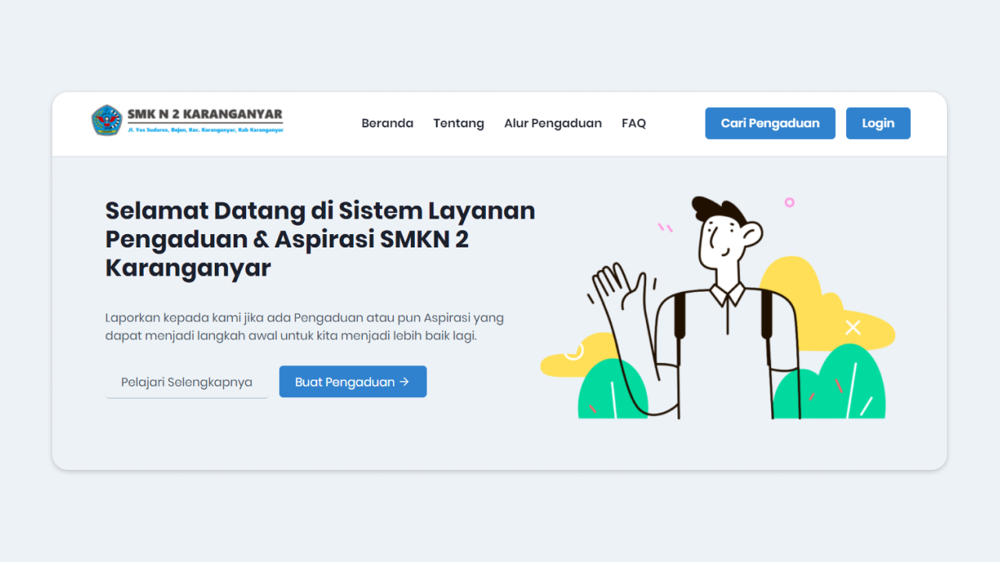

# Sistem Pengaduan Sekolah

## Preview

### How To Run This App

1. Clone this repository.  
   `git clone git@github.com:erpeel-a/Sistem-Pengaduan-Sekolah-SMKN2Karanganyar-Frontend.git`
2. Also [this repository](https://github.com/erpeel-a/Sistem-Pengaduan-Sekolah-SMKN2Karanganyar) for the backend to provide API. Follow instructions in that repository.
3. Install all dependencies.  
   `yarn install` or only `yarn`
4. Make file `.env` and set `REACT_APP_API_URL` inside that file.
5. Run the development server.  
   `yarn start`

### Tech Used

- React ([https://reactjs.org/](https://reactjs.org/))
- Chakra UI ([https://chakra-ui.com/](https://chakra-ui.com/))
- And other supporting libraries.

### Contributors

- [Hendra Agil Syaputra](https://github.com/hendraaagil)
- [Muhamad Zainal Arifin](https://github.com/Zainal21)
- [Niko Febriyanto](https://github.com/NFebri)

&copy; 2021 XII RPL A SMKN 2 Karanganyar.
